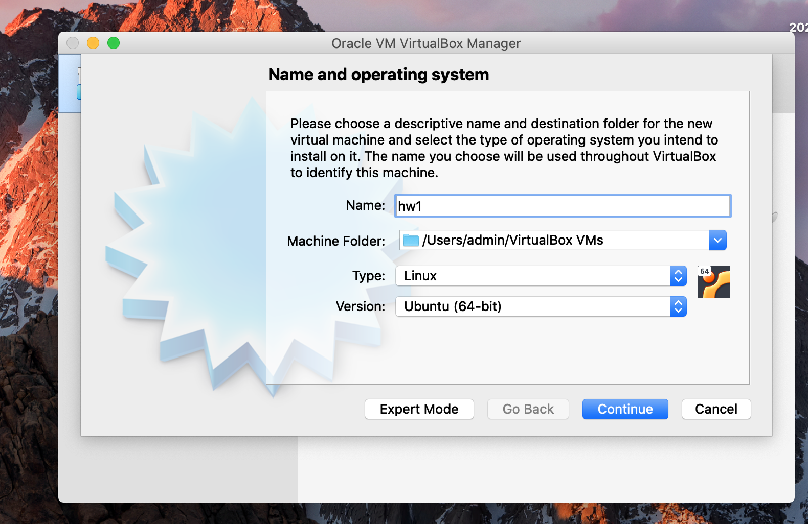
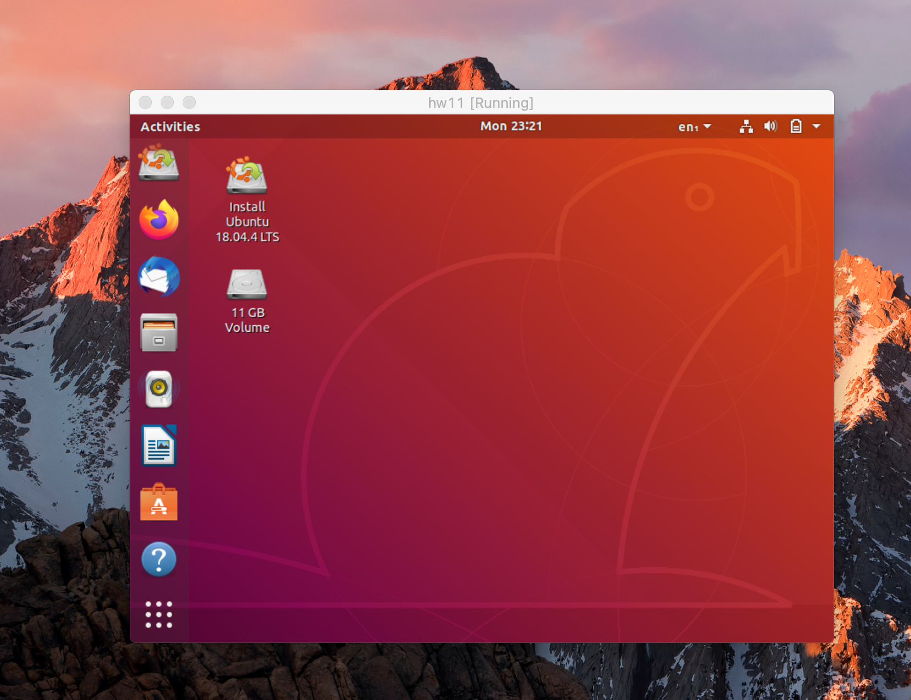
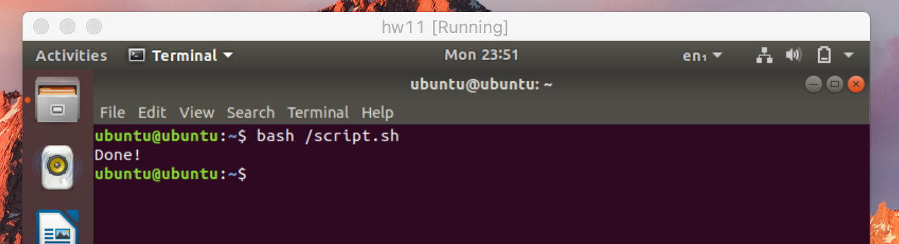
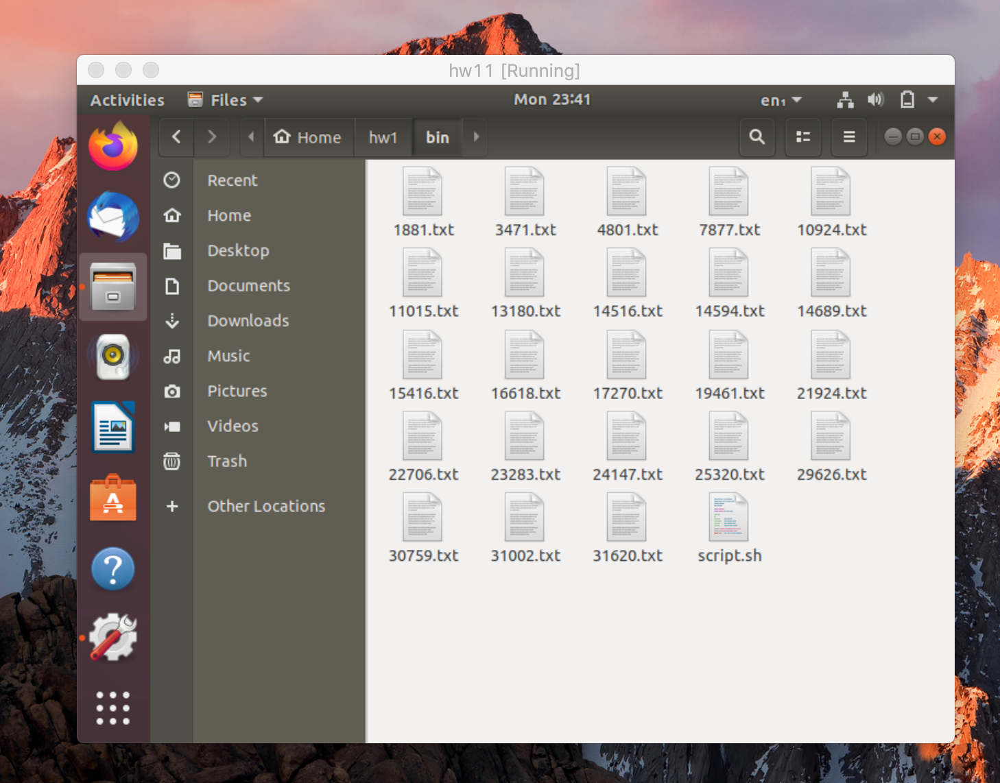
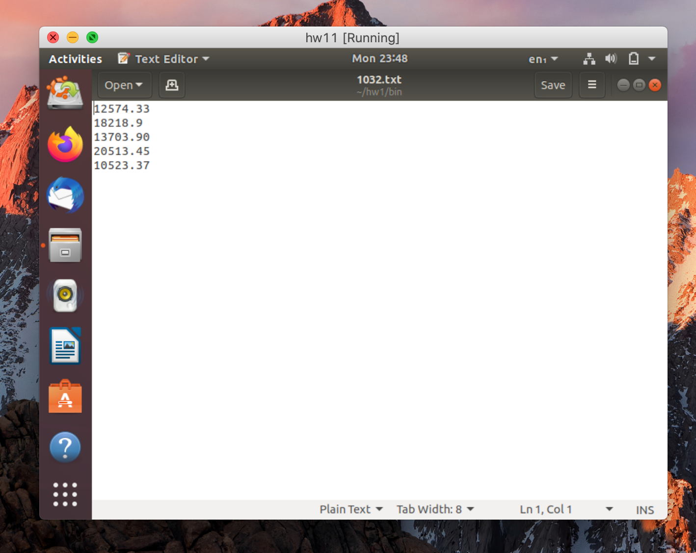

# hw1 cloud

## 1)

- Downlaod VirtualBox

  -  https://www.virtualbox.org/wiki/Downloads

- Download Ubuntu
  -  https://ubuntu.com/download/desktop

- Create new VM



- Start VM and install Ubuntu



- Move script to `/script.sh`

  - I did that using `Shared folders`

- Run it:




## 2 A-E

- see script.sh

## 2 F

Create file `sudo nano /etc/rc.local`

```
#!/bin/bash

sh ~/hw1/bin/script.sh
```

Make it executable: `sudo chmod +x /etc/rc.local`


## Result



